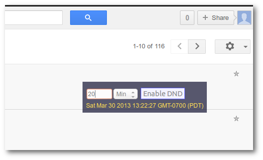

Google Voice Do-Not-Disturb Button
===================================

### Install from [GreasyFork](https://greasyfork.org/en/scripts/11292-gvoice-dnd)

Features
--------
- Shows a "do not disturb" button on all Google Voice pages
- Has input for the duration of the do not disturb period (default is 20)

Requires
--------
One of the following:
- [TamperMonkey](https://chrome.google.com/webstore/detail/tampermonkey/dhdgffkkebhmkfjojejmpbldmpobfkfo?hl=en) with [Chrome](https://www.google.com/chrome/browser/)
- [GreaseMonkey](https://addons.mozilla.org/en-US/firefox/addon/greasemonkey/) with [Firefox](https://www.mozilla.org/firefox)
- [ViolentMonkey](https://addons.opera.com/en/extensions/details/violent-monkey/) / [TamperMonkey](https://addons.opera.com/en/extensions/details/tampermonkey-beta/?display=en) with [Opera](http://www.opera.com/) - untested

License
-------
GPL 3
